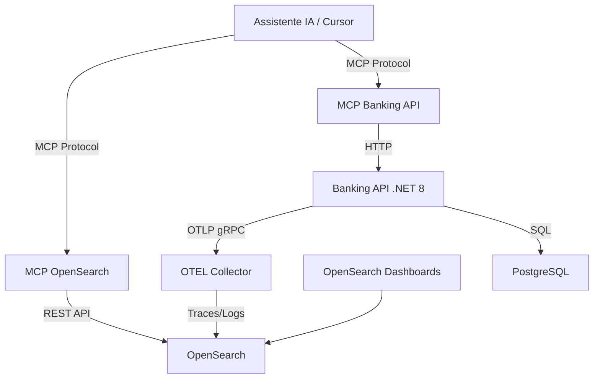

# 🏦 POC: Banking API com MCP Servers

## 📋 Sumário

Este projeto é uma **Prova de Conceito (POC)** que demonstra a integração entre uma API bancária moderna e **Model Context Protocol (MCP) Servers**, permitindo que assistentes de IA (como Claude/Cursor) interajam diretamente com a API e consultem dados de observabilidade em tempo real.

## 🎯 Objetivo

O principal objetivo desta POC é **validar o uso de IA com MCP Servers** para:

1. **Interação com APIs**: Permitir que assistentes de IA executem operações bancárias (criar usuários, transferências, consultas) através de um MCP Server dedicado
2. **Análise de Observabilidade**: Consultar logs e traces no OpenSearch através de outro MCP Server, facilitando debugging e análise de comportamento da aplicação
3. **Automação Inteligente**: Demonstrar como IAs podem automatizar tarefas de desenvolvimento, testes e troubleshooting usando MCP como ponte

## 🏗️ Componentes do Projeto

### Stack Técnica

- **ASP.NET Core 8** (Minimal API) - API bancária principal
- **Serilog** - Logging estruturado com sink OTLP nativo
- **OpenTelemetry** - Telemetria completa (traces, métricas e logs)
- **OpenTelemetry Collector** - Recebe e processa dados OTLP
- **OpenSearch** - Armazenamento de logs e traces
- **OpenSearch Dashboards** - Visualização de dados
- **PostgreSQL** - Banco de dados relacional
- **Docker Compose** - Orquestração de containers

### MCP Servers

1. **mcp-banking-api**: Expõe endpoints da API bancária como ferramentas MCP
   - Criar usuários e contas
   - Realizar transferências
   - Consultar saldos e transações
   - Listar usuários

2. **mcp-opensearch**: Permite consultas ao OpenSearch via MCP
   - Buscar logs por período, severidade ou texto
   - Consultar traces e spans
   - Analisar métricas de performance
   - Correlacionar logs com traces

## 🏗️ Arquitetura



### Fluxo de Dados

1. **Aplicação → Observabilidade**: A Banking API envia logs e traces via OTLP para o Collector, que processa e armazena no OpenSearch
2. **IA → Banking API**: O assistente de IA usa o MCP Banking Server para executar operações bancárias
3. **IA → OpenSearch**: O assistente de IA usa o MCP OpenSearch Server para consultar logs e traces
4. **Análise Visual**: OpenSearch Dashboards permite visualização manual dos dados

## 📋 Pré-requisitos

- Docker e Docker Compose instalados
- curl (para testes manuais)

## 🚀 Setup e Execução

### 1. Iniciar o Ambiente

Execute o comando abaixo para construir e iniciar todos os containers:

```bash
docker compose up -d --build
```

Isso irá:
- Subir **PostgreSQL** e criar o banco de dados
- Subir **OpenSearch** e **OpenSearch Dashboards**
- Subir **OTEL Collector**
- Construir e subir **Banking API**
- Construir e subir **MCP Banking API Server**
- Construir e subir **MCP OpenSearch Server**
- Executar script de inicialização automática que:
  - Configura index patterns no OpenSearch Dashboards
  - Cria 20 usuários de teste
  - Executa 1.000 operações bancárias
  - Gera logs e traces para demonstração

### 2. Validar Serviços

Verifique se todos os containers estão rodando:

```bash
docker compose ps
```

Acesse os serviços:
- **API Swagger**: http://localhost:5001/swagger
- **OpenSearch Dashboards**: http://localhost:5601
- **API Health Check**: http://localhost:5001/ping

### 3. Configurar MCP Servers no Cursor/Claude Desktop

Para usar os MCP Servers com seu assistente de IA, adicione ao arquivo de configuração:

**Para Cursor** (`~/.cursor/mcp_config.json`):
```json
{
  "mcpServers": {
    "banking-api": {
      "command": "docker",
      "args": ["exec", "-i", "mcp-banking-api", "python", "server.py"]
    },
    "opensearch": {
      "command": "docker",
      "args": ["exec", "-i", "mcp-opensearch", "python", "server.py"]
    }
  }
}
```

**Para Claude Desktop** (`~/Library/Application Support/Claude/claude_desktop_config.json` no macOS):
```json
{
  "mcpServers": {
    "banking-api": {
      "command": "docker",
      "args": ["exec", "-i", "mcp-banking-api", "python", "server.py"]
    },
    "opensearch": {
      "command": "docker",
      "args": ["exec", "-i", "mcp-opensearch", "python", "server.py"]
    }
  }
}
```

Reinicie o Cursor ou Claude Desktop após a configuração.

## 🤖 Usando MCP Servers com IA

Após configurar os MCP Servers, você pode interagir com o sistema através de comandos em linguagem natural:

### Exemplos de Comandos - Banking API

```
"Crie um novo usuário chamado João Silva com email joao@test.com"
"Liste todos os usuários cadastrados"
"Faça uma transferência de R$ 100 da conta X para a conta Y"
"Consulte o saldo da conta do usuário joao@test.com"
"Liste as últimas transações"
```

### Exemplos de Comandos - OpenSearch

```
"Mostre os logs de erro das últimas 2 horas"
"Busque logs relacionados a transferências com falha"
"Analise os traces da operação de transferência"
"Quais são os endpoints mais lentos da API?"
"Mostre logs do usuário com correlationId X"
```

## 🧪 Testes Manuais (Opcional)

Se preferir testar manualmente sem usar MCP:

### 1. Executar Testes via curl

```bash
chmod +x run-tests.sh
./run-tests.sh
```

### 2. Gerar Carga Adicional

O script de inicialização já gera 1.000 requests automaticamente. Para gerar mais:

```bash
# Edite init-and-test.sh e ajuste as variáveis:
# TOTAL_CLIENTS=50
# OPERATIONS_PER_CLIENT=100
docker compose restart environment-init
```

## 📊 Observabilidade no OpenSearch

Acesse o OpenSearch Dashboards em http://localhost:5601 e vá para a seção **Discover**.

### Logs (`logs-banking-api`)

Todos os logs da aplicação são estruturados e exportados via OTLP. Campos importantes:
- `TraceId` e `SpanId`: Correlação com traces
- `Attributes.correlationId`: Rastreamento de requisições
- `Attributes.clientId`: Identificação do cliente
- `SeverityText`: Nível do log (Information, Warning, Error)
- `Body`: Mensagem do log

### Traces (`traces-banking-api`)

Visualize o fluxo completo das requisições:
- Spans HTTP (POST /transactions)
- Spans Internos (TransferFunds)
- Spans de Banco de Dados (PostgreSQL)

## 🛠️ Estrutura do Projeto

```
banking-poc/
├── BankingApi/                 # Projeto .NET 8
│   ├── Configuration/          # Configuração Serilog e OTEL
│   ├── Data/                   # EF Core Context e Migrations
│   ├── DTOs/                   # Modelos de Request/Response
│   ├── Endpoints/              # Minimal API Endpoints
│   ├── Middleware/             # Middlewares de Correlação
│   └── Program.cs              # Entry point
├── mcp-banking-api/            # MCP Server para Banking API
│   ├── server.py               # Implementação do MCP Server
│   ├── requirements.txt        # Dependências Python
│   └── Dockerfile              # Container do MCP Server
├── mcp-opensearch/             # MCP Server para OpenSearch
│   ├── server.py               # Implementação do MCP Server
│   ├── requirements.txt        # Dependências Python
│   └── Dockerfile              # Container do MCP Server
├── docker-compose.yml          # Orquestração completa
├── otel-collector.yaml         # Configuração do Collector
├── init-and-test.sh            # Script de inicialização e testes
└── README.md                   # Esta documentação
```

## 🔧 Detalhes Técnicos

### MCP Banking API Server

Ferramentas disponíveis:
- `create_user`: Cria novo usuário e conta bancária
- `list_users`: Lista todos os usuários
- `get_balance`: Consulta saldo de uma conta
- `transfer_funds`: Realiza transferência entre contas
- `list_transactions`: Lista transações de uma conta

### MCP OpenSearch Server

Ferramentas disponíveis:
- `search_logs`: Busca logs por período, severidade ou texto
- `search_traces`: Consulta traces e spans
- `get_log_by_id`: Obtém log específico por ID
- `get_trace_by_id`: Obtém trace completo por ID
- `aggregate_logs`: Agregações e estatísticas de logs

## 💡 Casos de Uso da POC

### 1. Desenvolvimento Assistido por IA
- Criar e testar endpoints através de comandos em linguagem natural
- Gerar dados de teste automaticamente
- Validar comportamento da API sem escrever código

### 2. Debugging Inteligente
- Analisar logs de erro com contexto completo
- Correlacionar traces com logs para identificar gargalos
- Investigar falhas através de perguntas em linguagem natural

### 3. Análise de Performance
- Identificar endpoints lentos
- Analisar padrões de erro
- Gerar relatórios de observabilidade

### 4. Automação de Testes
- Criar cenários de teste complexos via IA
- Validar comportamento esperado
- Gerar dados de carga realistas

## 📝 Notas Técnicas

- A API escuta na porta **5001** (mapeada para 80 no container)
- Serilog exporta logs **diretamente** via OTLP gRPC para melhor performance
- Banco de dados é migrado automaticamente no startup
- MCP Servers usam **stdio** para comunicação com assistentes de IA
- Containers MCP ficam em execução contínua aguardando conexões
- Script de inicialização gera **1.000 requests** automaticamente para demonstração

## 🐛 Troubleshooting

### API não responde
```bash
docker logs banking-api
```

### Logs não aparecem no OpenSearch
1. Verifique se o OTEL Collector está rodando:
   ```bash
   docker logs otel-collector
   ```
2. Verifique se os índices existem:
   ```bash
   curl http://localhost:9200/_cat/indices?v
   ```

### MCP Server não conecta
1. Verifique se os containers estão rodando:
   ```bash
   docker ps | grep mcp
   ```
2. Teste a conexão manualmente:
   ```bash
   docker exec -i mcp-banking-api python server.py
   ```
3. Verifique os logs:
   ```bash
   docker logs mcp-banking-api
   docker logs mcp-opensearch
   ```

### Reiniciar ambiente completo
```bash
docker compose down -v
docker compose up -d --build
```

## 🎓 Aprendizados e Insights

Esta POC demonstra:

1. **Integração IA + Observabilidade**: Como assistentes de IA podem consultar logs e traces para debugging
2. **Automação via MCP**: Como MCP Servers permitem que IAs executem operações complexas
3. **Observabilidade Moderna**: Stack completa com OpenTelemetry e OpenSearch
4. **Desenvolvimento Ágil**: Como IA pode acelerar desenvolvimento e testes
5. **Arquitetura Cloud-Native**: Uso de containers, telemetria distribuída e APIs modernas

## 📚 Referências

- [Model Context Protocol (MCP)](https://modelcontextprotocol.io/)
- [OpenTelemetry](https://opentelemetry.io/)
- [OpenSearch](https://opensearch.org/)
- [Serilog](https://serilog.net/)
- [ASP.NET Core](https://docs.microsoft.com/aspnet/core/)

## 📄 Licença

Este é um projeto de **Prova de Conceito (POC)** para fins educacionais e de demonstração.

---

**Desenvolvido para validar a integração entre IA, MCP Servers e Observabilidade Moderna** 🚀
