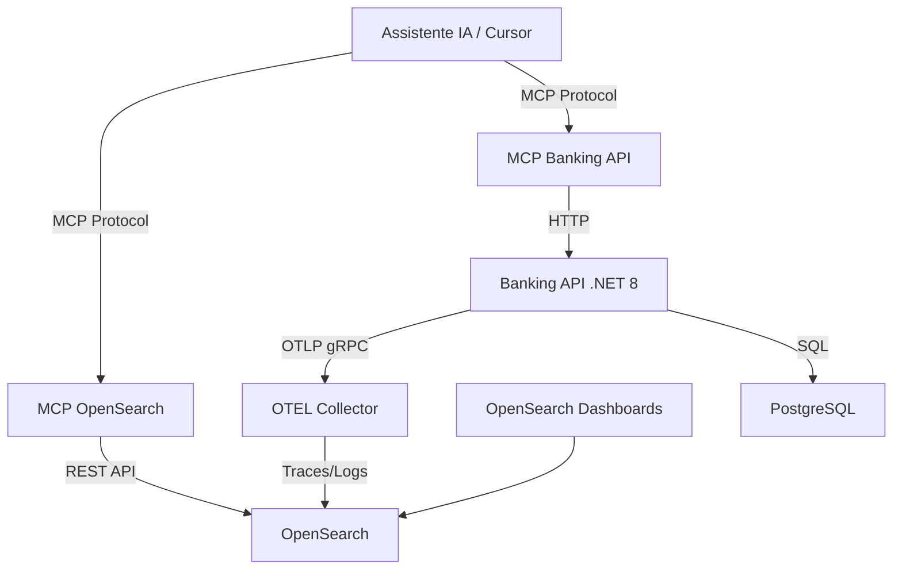

# 🏦 POC: Banking API com MCP Servers

## 📋 Sumário

Este projeto é uma **Prova de Conceito (POC)** que demonstra a integração entre uma API bancária moderna e **Model Context Protocol (MCP) Servers**, permitindo que assistentes de IA (como Claude/Cursor) interajam diretamente com a API e consultem dados de observabilidade em tempo real.

## ⚡ Início Rápido

```bash
docker compose up -d --build
```

**Pronto!** O comando acima:
- ✅ Sobe toda a infraestrutura (PostgreSQL, OpenSearch, OTEL Collector)
- ✅ Inicia a Banking API e MCP Servers
- ✅ Cria **20 usuários de teste** automaticamente
- ✅ Executa **1.000 requests reais** simulando operações bancárias
- ✅ Gera logs e traces para demonstração imediata

**⏱️ Tempo**: 5-10 minutos | **📖 Guia completo**: [QUICKSTART.md](docs/QUICKSTART.md)

## 🎯 Objetivo

O principal objetivo desta POC é **validar o uso de IA com MCP Servers** para:

1. **Interação com APIs**: Permitir que assistentes de IA executem operações bancárias (criar usuários, transferências, consultas) através de um MCP Server dedicado
2. **Análise de Observabilidade**: Consultar logs e traces no OpenSearch através de outro MCP Server, facilitando debugging e análise de comportamento da aplicação
3. **Automação Inteligente**: Demonstrar como IAs podem automatizar tarefas de desenvolvimento, testes e troubleshooting usando MCP como ponte

## 🎁 O que você ganha de graça?

Ao executar `docker compose up`, o sistema **automaticamente**:

### Dados de Teste Realistas
- **20 usuários** criados com emails únicos
- **1.000 operações bancárias** executadas
- **~1.200 logs** indexados no OpenSearch
- **~3.500 traces** com spans detalhados

### Cenários Variados
- ✅ Transferências bem-sucedidas (~40%)
- ❌ Erros de saldo insuficiente (~40%)
- ❌ Contas não encontradas (~20%)

### Ambiente Completo
- API REST documentada (Swagger)
- OpenSearch Dashboards configurado
- MCP Servers prontos para uso
- Dados prontos para análise

## 🏗️ Componentes do Projeto

### Stack Técnica

- **ASP.NET Core 8** (Minimal API) - API bancária principal
- **Serilog** - Logging estruturado com sink OTLP nativo
- **OpenTelemetry** - Telemetria completa (traces, métricas e logs)
- **OpenTelemetry Collector** - Recebe e processa dados OTLP
- **OpenSearch** - Armazenamento de logs e traces
- **OpenSearch Dashboards** - Visualização de dados
- **PostgreSQL** - Banco de dados relacional
- **Docker Compose** - Orquestração de containers

### MCP Servers

1. **mcp-banking-api**: Expõe endpoints da API bancária como ferramentas MCP
   - Criar usuários e contas
   - Realizar transferências
   - Consultar saldos e transações
   - Listar usuários

2. **mcp-opensearch**: Permite consultas ao OpenSearch via MCP
   - Buscar logs por período, severidade ou texto
   - Consultar traces e spans
   - Analisar métricas de performance
   - Correlacionar logs com traces

## 🏗️ Arquitetura



### Fluxo de Dados

1. **Aplicação → Observabilidade**: A Banking API envia logs e traces via OTLP para o Collector, que processa e armazena no OpenSearch
2. **IA → Banking API**: O assistente de IA usa o MCP Banking Server para executar operações bancárias
3. **IA → OpenSearch**: O assistente de IA usa o MCP OpenSearch Server para consultar logs e traces
4. **Análise Visual**: OpenSearch Dashboards permite visualização manual dos dados

## 📚 Documentação

Esta POC possui documentação completa organizada por tópicos:

| Documento | Descrição |
|-----------|-----------|
| **[⚡ QUICKSTART](docs/QUICKSTART.md)** | Início rápido - Execute e tenha tudo funcionando em 5 minutos |
| **[🚀 SETUP](docs/SETUP.md)** | Guia completo de instalação e configuração dos MCP Servers |
| **[🏗️ ARCHITECTURE](docs/ARCHITECTURE.md)** | Arquitetura detalhada do sistema e fluxo de dados |
| **[🤖 MCP_SERVERS](docs/MCP_SERVERS.md)** | Guia completo dos MCP Servers e suas ferramentas |
| **[📖 USAGE](docs/USAGE.md)** | Exemplos práticos de uso com IA e manualmente |

**👉 Novo por aqui?** Comece pelo [QUICKSTART](docs/QUICKSTART.md)!

## 📋 Pré-requisitos

- Docker e Docker Compose instalados
- curl (para testes manuais)
- Cursor ou Claude Desktop (para usar MCP Servers)

## 🚀 Como Usar

### Passo 1: Iniciar o Ambiente

```bash
docker compose up -d --build
```

Aguarde 5-10 minutos. O sistema irá automaticamente:
- ✅ Configurar toda a infraestrutura
- ✅ Criar 20 usuários de teste
- ✅ Executar 1.000 requests reais
- ✅ Gerar logs e traces

**📖 Detalhes**: Veja o [QUICKSTART](docs/QUICKSTART.md) para entender o que acontece

### Passo 2: Verificar

```bash
docker compose ps
curl http://localhost:5001/ping
```

**Acesse**:
- API Swagger: http://localhost:5001/swagger
- OpenSearch Dashboards: http://localhost:5601

### Passo 3: Configurar MCP (Opcional)

Para usar com IA, configure os MCP Servers:

```json
// ~/.cursor/mcp_config.json ou Claude Desktop config
{
  "mcpServers": {
    "banking-api": {
      "command": "docker",
      "args": ["exec", "-i", "mcp-banking-api", "python", "server.py"]
    },
    "opensearch": {
      "command": "docker",
      "args": ["exec", "-i", "mcp-opensearch", "python", "server.py"]
    }
  }
}
```

**📖 Guia completo**: [SETUP.md](docs/SETUP.md)

## 🤖 Exemplos de Uso

### Com IA (via MCP Servers)

```
"Crie um usuário chamado João Silva com email joao@test.com"
"Liste todos os usuários cadastrados"
"Faça uma transferência de R$ 100 entre dois usuários"
"Mostre os logs de erro das últimas 2 horas"
"Analise os traces da última transferência"
"Quais endpoints estão mais lentos?"
```

**📖 Mais exemplos**: [USAGE.md](docs/USAGE.md)

### Manualmente (via API REST)

```bash
# Criar usuário
curl -X POST http://localhost:5001/users \
  -H "Content-Type: application/json" \
  -d '{"name":"João","email":"joao@test.com","initialBalance":1000}'

# Listar usuários
curl http://localhost:5001/users

# Ver logs no OpenSearch
curl http://localhost:9200/logs-banking-api/_search
```

**📖 Guia completo**: [USAGE.md](docs/USAGE.md)

## 📊 Observabilidade no OpenSearch

Acesse o OpenSearch Dashboards em http://localhost:5601 e vá para a seção **Discover**.

### Logs (`logs-banking-api`)

Todos os logs da aplicação são estruturados e exportados via OTLP. Campos importantes:
- `TraceId` e `SpanId`: Correlação com traces
- `Attributes.correlationId`: Rastreamento de requisições
- `Attributes.clientId`: Identificação do cliente
- `SeverityText`: Nível do log (Information, Warning, Error)
- `Body`: Mensagem do log

### Traces (`traces-banking-api`)

Visualize o fluxo completo das requisições:
- Spans HTTP (POST /transactions)
- Spans Internos (TransferFunds)
- Spans de Banco de Dados (PostgreSQL)

## 🛠️ Estrutura do Projeto

```
banking-poc/
├── BankingApi/                 # Projeto .NET 8
│   ├── Configuration/          # Configuração Serilog e OTEL
│   ├── Data/                   # EF Core Context e Migrations
│   ├── DTOs/                   # Modelos de Request/Response
│   ├── Endpoints/              # Minimal API Endpoints
│   ├── Middleware/             # Middlewares de Correlação
│   └── Program.cs              # Entry point
├── mcp-banking-api/            # MCP Server para Banking API
│   ├── server.py               # Implementação do MCP Server
│   ├── requirements.txt        # Dependências Python
│   └── Dockerfile              # Container do MCP Server
├── mcp-opensearch/             # MCP Server para OpenSearch
│   ├── server.py               # Implementação do MCP Server
│   ├── requirements.txt        # Dependências Python
│   └── Dockerfile              # Container do MCP Server
├── docker-compose.yml          # Orquestração completa
├── otel-collector.yaml         # Configuração do Collector
├── init-and-test.sh            # Script de inicialização e testes
└── README.md                   # Esta documentação
```

## 🔧 Detalhes Técnicos

### MCP Banking API Server

Ferramentas disponíveis:
- `create_user`: Cria novo usuário e conta bancária
- `list_users`: Lista todos os usuários
- `get_balance`: Consulta saldo de uma conta
- `transfer_funds`: Realiza transferência entre contas
- `list_transactions`: Lista transações de uma conta

### MCP OpenSearch Server

Ferramentas disponíveis:
- `search_logs`: Busca logs por período, severidade ou texto
- `search_traces`: Consulta traces e spans
- `get_log_by_id`: Obtém log específico por ID
- `get_trace_by_id`: Obtém trace completo por ID
- `aggregate_logs`: Agregações e estatísticas de logs

## 💡 Casos de Uso da POC

### 1. Desenvolvimento Assistido por IA
- Criar e testar endpoints através de comandos em linguagem natural
- Gerar dados de teste automaticamente
- Validar comportamento da API sem escrever código

### 2. Debugging Inteligente
- Analisar logs de erro com contexto completo
- Correlacionar traces com logs para identificar gargalos
- Investigar falhas através de perguntas em linguagem natural

### 3. Análise de Performance
- Identificar endpoints lentos
- Analisar padrões de erro
- Gerar relatórios de observabilidade

### 4. Automação de Testes
- Criar cenários de teste complexos via IA
- Validar comportamento esperado
- Gerar dados de carga realistas

## 📝 Notas Técnicas

- A API escuta na porta **5001** (mapeada para 80 no container)
- Serilog exporta logs **diretamente** via OTLP gRPC para melhor performance
- Banco de dados é migrado automaticamente no startup
- MCP Servers usam **stdio** para comunicação com assistentes de IA
- Containers MCP ficam em execução contínua aguardando conexões
- Script de inicialização gera **1.000 requests** automaticamente para demonstração

## 🐛 Problemas Comuns

### Container não inicia
```bash
docker compose logs <service-name>
```

### Sem dados no OpenSearch
```bash
# Verificar se a simulação executou
docker logs environment-init --tail 20

# Re-executar simulação
docker compose restart environment-init
```

### MCP Server não conecta
```bash
# Verificar containers
docker ps | grep mcp

# Ver logs
docker logs mcp-banking-api
```

### Recomeçar do zero
```bash
docker compose down -v
docker compose up -d --build
```

**📖 Mais soluções**: Consulte a documentação completa acima

## 🎓 O que esta POC demonstra

1. **Integração IA + Observabilidade**: Como assistentes de IA podem consultar logs e traces para debugging
2. **Automação via MCP**: Como MCP Servers permitem que IAs executem operações complexas
3. **Observabilidade Moderna**: Stack completa com OpenTelemetry e OpenSearch
4. **Dados Realistas**: Geração automática de 1.000 requests com cenários variados
5. **Arquitetura Cloud-Native**: Containers, telemetria distribuída e APIs modernas

## 🔗 Links Úteis

### Documentação do Projeto
- [⚡ Início Rápido](docs/QUICKSTART.md)
- [🚀 Setup Completo](docs/SETUP.md)
- [🏗️ Arquitetura](docs/ARCHITECTURE.md)
- [🤖 MCP Servers](docs/MCP_SERVERS.md)
- [📖 Guia de Uso](docs/USAGE.md)

### Tecnologias
- [Model Context Protocol (MCP)](https://modelcontextprotocol.io/)
- [OpenTelemetry](https://opentelemetry.io/)
- [OpenSearch](https://opensearch.org/)
- [Serilog](https://serilog.net/)
- [ASP.NET Core](https://docs.microsoft.com/aspnet/core/)

## 📄 Licença

Este é um projeto de **Prova de Conceito (POC)** para fins educacionais e de demonstração.

---

**Desenvolvido para validar a integração entre IA, MCP Servers e Observabilidade Moderna** 🚀
