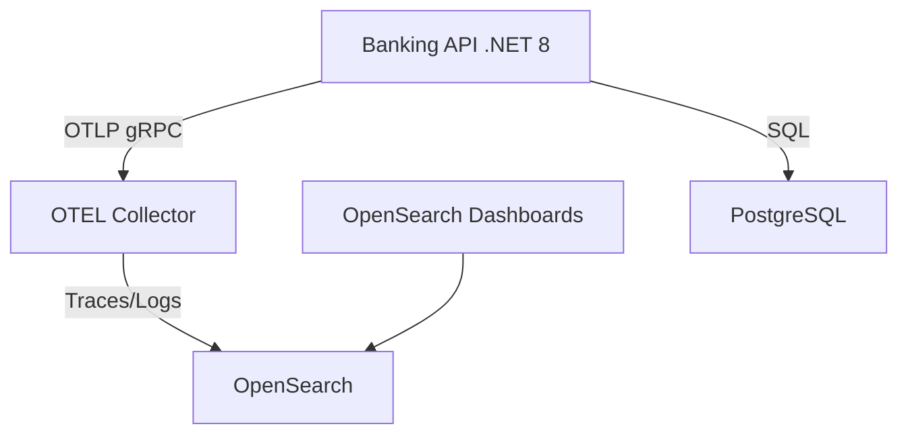

# POC API Bancária Observável

POC completa de uma API Bancária em .NET 8 com foco em **Observabilidade e Logs Estruturados**, utilizando:

- **ASP.NET Core 8** (Minimal API)
- **Serilog** para logging estruturado (com sink nativo OTLP)
- **OpenTelemetry** para telemetria (traces, métricas e logs)
- **OpenTelemetry Collector** recebendo OTLP da API
- **OpenSearch** como destino único de observabilidade
- **OpenSearch Dashboards** para visualização
- **PostgreSQL** como banco de dados
- **Docker Compose** para orquestração local

## 🏗️ Arquitetura



## 📋 Pré-requisitos

- Docker e Docker Compose instalados
- curl (para testes manuais)

## 🚀 Setup e Execução

### 1. Iniciar o Ambiente

Execute o comando abaixo para construir e iniciar todos os containers:

```bash
docker compose up -d --build
```

Isso irá:
- Subir **PostgreSQL** e criar o banco de dados
- Subir **OpenSearch** e **OpenSearch Dashboards**
- Subir **OTEL Collector**
- Construir e subir **Banking API**
- Executar script de inicialização (`opensearch-dashboards-init`) para configurar os index patterns automaticamente

### 2. Validar Serviços

Verifique se todos os containers estão rodando:

```bash
docker compose ps
```

Acesse os serviços:
- **API Swagger**: http://localhost:5001/swagger
- **OpenSearch Dashboards**: http://localhost:5601
- **API Health Check**: http://localhost:5001/ping

## 🧪 Testes e Simulação

### 1. Executar Testes Automatizados

O projeto inclui um script que executa uma bateria de testes via `curl` (`curl-tests.http`):

```bash
chmod +x run-tests.sh
./run-tests.sh
```

### 2. Simulação de Carga (50 Clientes)

Para gerar tráfego realista e popular o OpenSearch com logs e traces:

```bash
chmod +x simulate-clients.sh
./simulate-clients.sh
```

Este script irá:
- Criar 50 clientes com dados aleatórios
- Realizar login para cada um
- Executar 30 operações (transferências) por cliente
- Gerar erros intencionais (saldo insuficiente) para testar logs de erro

### 3. Validar Resultados da Simulação

Após a simulação, verifique a integridade dos dados:

```bash
chmod +x validate-simulation.sh
./validate-simulation.sh
```

## 📊 Observabilidade no OpenSearch

Acesse o OpenSearch Dashboards em http://localhost:5601 e vá para a seção **Discover**.

### Logs (`logs-banking-api`)

Todos os logs da aplicação são estruturados e exportados via OTLP. Campos importantes:
- `TraceId` e `SpanId`: Correlação com traces
- `Attributes.correlationId`: Rastreamento de requisições
- `Attributes.clientId`: Identificação do cliente
- `SeverityText`: Nível do log (Information, Warning, Error)
- `Body`: Mensagem do log

### Traces (`traces-banking-api`)

Visualize o fluxo completo das requisições:
- Spans HTTP (POST /transactions)
- Spans Internos (TransferFunds)
- Spans de Banco de Dados (PostgreSQL)

## 🛠️ Estrutura do Projeto

```
banking-poc/
├── BankingApi/                 # Projeto .NET 8
│   ├── Configuration/          # Configuração Serilog e OTEL
│   ├── Data/                   # EF Core Context e Migrations
│   ├── DTOs/                   # Modelos de Request/Response
│   ├── Endpoints/              # Minimal API Endpoints
│   ├── Middleware/             # Middlewares de Correlação
│   └── Program.cs              # Entry point
├── docker-compose.yml          # Orquestração
├── otel-collector.yaml         # Configuração do Collector
├── curl-tests.http             # Cenários de teste
├── simulate-clients.sh         # Script de carga
├── validate-simulation.sh      # Script de validação
└── opensearch-dashboards-init.sh # Script de setup do Dashboards
```

## 📝 Notas de Desenvolvimento

- A API escuta na porta **5001** (mapeada para 80 no container).
- O Serilog foi configurado para exportar logs **diretamente** para o Collector via OTLP gRPC, garantindo melhor performance e confiabilidade em relação ao console scraping.
- O banco de dados é recriado/migrado automaticamente no startup da API.

## 🐛 Troubleshooting

**API não responde?**
```bash
docker logs banking-api
```

**Logs não aparecem no OpenSearch?**
1. Verifique se o container `otel-collector` está rodando.
2. Verifique os logs do collector:
   ```bash
   docker logs otel-collector
   ```
3. Verifique se o índice existe:
   ```bash
   curl http://localhost:9200/_cat/indices?v
   ```

## 📄 Licença

Este é um projeto de POC para fins didáticos.
