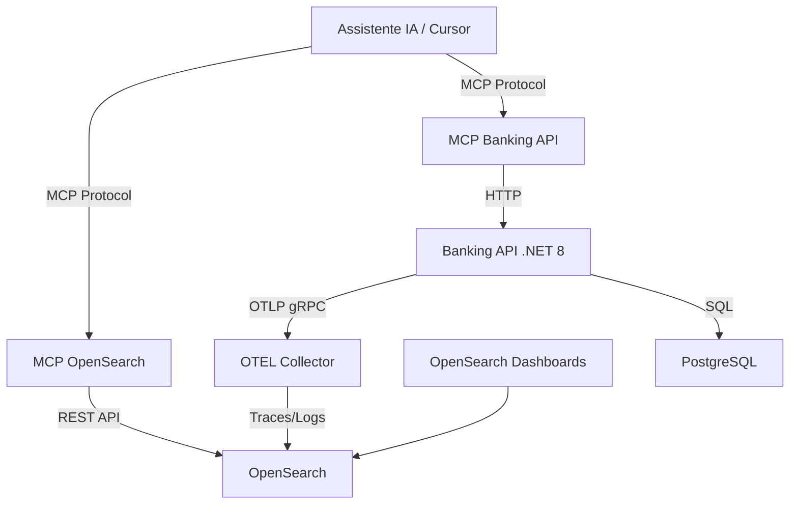
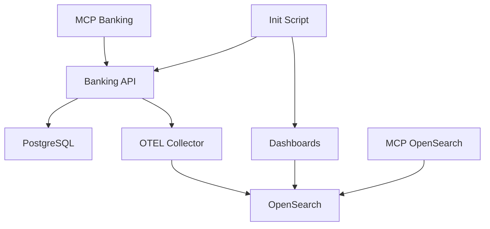

# 🏗️ Arquitetura do Sistema

## Visão Geral

Este documento descreve a arquitetura completa da POC, incluindo todos os componentes e suas interações.

## Diagrama de Arquitetura



## Componentes

### 1. Banking API (.NET 8)

**Responsabilidade**: API REST para operações bancárias

**Tecnologias**:
- ASP.NET Core 8 (Minimal API)
- Entity Framework Core
- Serilog (logging estruturado)
- OpenTelemetry SDK

**Endpoints Principais**:
- `POST /users` - Criar usuário e conta
- `GET /users` - Listar usuários
- `GET /accounts/{id}/balance` - Consultar saldo
- `POST /transactions` - Realizar transferência
- `GET /accounts/{id}/transactions` - Listar transações

**Porta**: 5001 (host) → 80 (container)

### 2. MCP Banking API Server

**Responsabilidade**: Expor operações da Banking API como ferramentas MCP

**Tecnologias**:
- Python 3.11
- mcp library
- httpx (cliente HTTP)

**Ferramentas MCP**:
- `create_user(name, email, initial_balance)`
- `list_users()`
- `get_balance(account_id)`
- `transfer_funds(from_account_id, to_account_id, amount)`
- `list_transactions(account_id, limit)`

**Comunicação**: stdio (stdin/stdout)

### 3. MCP OpenSearch Server

**Responsabilidade**: Consultar logs e traces no OpenSearch via MCP

**Tecnologias**:
- Python 3.11
- mcp library
- opensearch-py (cliente OpenSearch)

**Ferramentas MCP**:
- `search_logs(query, severity, start_time, end_time, size)`
- `search_traces(trace_id, span_id, start_time, end_time)`
- `get_log_by_id(log_id)`
- `get_trace_by_id(trace_id)`
- `aggregate_logs(field, interval)`

**Comunicação**: stdio (stdin/stdout)

### 4. OpenTelemetry Collector

**Responsabilidade**: Receber, processar e exportar telemetria

**Configuração**:
```yaml
receivers:
  otlp:
    protocols:
      grpc: 0.0.0.0:4317
      http: 0.0.0.0:4318

processors:
  batch:
    timeout: 10s
    send_batch_size: 1024

exporters:
  elasticsearch:
    endpoints: ["http://opensearch:9200"]
    logs_index: "logs-banking-api"
    traces_index: "traces-banking-api"
```

**Portas**:
- 4317: OTLP gRPC
- 4318: OTLP HTTP
- 13133: Health check

### 5. OpenSearch

**Responsabilidade**: Armazenar e indexar logs e traces

**Índices**:
- `logs-banking-api`: Logs estruturados da aplicação
- `traces-banking-api`: Traces e spans do OpenTelemetry

**Porta**: 9200 (REST API)

### 6. OpenSearch Dashboards

**Responsabilidade**: Interface visual para análise de dados

**Recursos**:
- Discover: Exploração de logs e traces
- Visualize: Criação de gráficos
- Dashboard: Painéis customizados

**Porta**: 5601

### 7. PostgreSQL

**Responsabilidade**: Banco de dados relacional

**Tabelas**:
- `Users`: Dados dos usuários
- `Accounts`: Contas bancárias
- `Transactions`: Histórico de transações

**Porta**: 5432

## Fluxo de Dados

### 1. Fluxo de Telemetria

```
Banking API → Serilog (OTLP Sink) → OTLP gRPC → OTEL Collector → OpenSearch
```

**Características**:
- Logs estruturados com contexto completo
- Correlação automática via TraceId/SpanId
- Enriquecimento com atributos customizados
- Batching para performance

### 2. Fluxo de Requisição via MCP

```
Assistente IA → MCP Protocol → MCP Server → HTTP/REST → Serviço de Destino
```

**Exemplo - Criar Usuário**:
1. IA envia comando: "Crie um usuário João"
2. MCP Banking Server recebe via stdio
3. Converte para chamada HTTP: `POST /users`
4. Banking API processa e retorna resposta
5. MCP Server formata resposta para IA
6. IA apresenta resultado ao usuário

### 3. Fluxo de Consulta de Logs via MCP

```
Assistente IA → MCP Protocol → MCP OpenSearch → REST API → OpenSearch
```

**Exemplo - Buscar Erros**:
1. IA envia comando: "Mostre logs de erro"
2. MCP OpenSearch Server recebe via stdio
3. Converte para query DSL do OpenSearch
4. OpenSearch retorna resultados
5. MCP Server formata e envia para IA
6. IA analisa e apresenta insights

## Padrões de Comunicação

### HTTP REST
- Banking API ↔ Clientes
- MCP Banking Server ↔ Banking API
- MCP OpenSearch Server ↔ OpenSearch

### gRPC
- Banking API ↔ OTEL Collector (OTLP)

### stdio
- Assistente IA ↔ MCP Servers

### SQL
- Banking API ↔ PostgreSQL

## Segurança

### Rede Interna
Todos os serviços rodam em uma rede Docker isolada (`banking-network`), com apenas as portas necessárias expostas ao host.

### Autenticação
- OpenSearch: Sem autenticação (ambiente de desenvolvimento)
- Banking API: Sem autenticação (POC)
- MCP Servers: Acesso via stdio (local)

**⚠️ Nota**: Esta é uma POC. Em produção, implemente:
- Autenticação JWT na API
- TLS/SSL em todas as comunicações
- Autenticação no OpenSearch
- Rate limiting
- Validação de entrada robusta

## Escalabilidade

### Componentes Stateless
- Banking API
- OTEL Collector
- MCP Servers

Podem ser escalados horizontalmente com load balancer.

### Componentes Stateful
- PostgreSQL: Requer replicação master-slave
- OpenSearch: Cluster com múltiplos nós

## Observabilidade

### Logs
- **Formato**: JSON estruturado
- **Campos**: TraceId, SpanId, Timestamp, Severity, Message, Attributes
- **Destino**: OpenSearch via OTEL Collector

### Traces
- **Formato**: OpenTelemetry Spans
- **Propagação**: W3C Trace Context
- **Destino**: OpenSearch via OTEL Collector

### Métricas
- **Formato**: OpenTelemetry Metrics
- **Destino**: Debug exporter (não persistido nesta POC)

## Resiliência

### Health Checks
- Banking API: `/ping`
- OTEL Collector: `:13133/health`
- OpenSearch: `/_cluster/health`

### Restart Policies
- Banking API: `unless-stopped`
- OTEL Collector: `unless-stopped`
- OpenSearch: `unless-stopped`
- PostgreSQL: `unless-stopped`
- MCP Servers: `unless-stopped`

### Timeouts
- OTEL Collector → OpenSearch: 60s
- Banking API → PostgreSQL: 30s
- MCP Servers → Banking API: 30s

## Dependências



**Ordem de Inicialização**:
1. PostgreSQL
2. OpenSearch
3. OTEL Collector
4. Banking API
5. OpenSearch Dashboards
6. MCP Servers
7. Init Script (testes)

